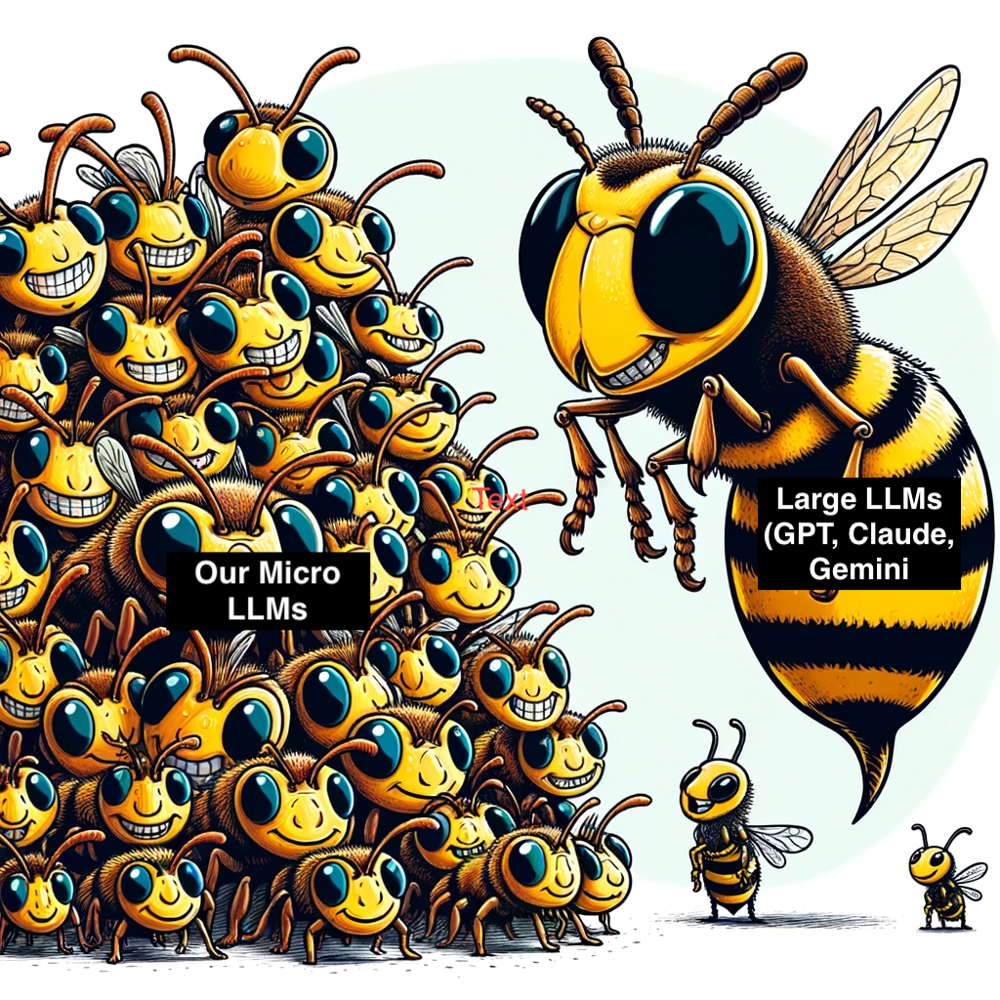

# Research Notes

> **Disclaimer:** The information below isn't backed by any research yet, it's an ongoing discovery to test out. 

## Problem

- Having one large LLM can lead to latency when integrating into an application. Users might also want to use their own internal data or fine-tune the model to meet specific requirements.
- Certain teams may require specific tuning, such as additional legal training and regular updates.
- Updating an LLM with the latest data is a significant task. With vendor lock-in, users must wait until the vendor updates their models. This can be problematic, especially for sectors that require daily updates with new data, such as the financial sector.

## Solution

- Build a platform that allows teams to bring their own models and fine-tuned datasets. This platform should facilitate easy integration of these models into the larger 'Hive model'.
- Allow LLMs to be compartmentalized into smaller LLMs, similar to a microservice architecture (feasibility of this approach is uncertain). This could potentially lead to better and more accurate results, and reduced latency.
- Implement a 'dictator' service that sits above the microLLMs. This service would determine which model is best suited for the problem or question asked. For instance, if a user asks about a law case from 1880, the micro Law LLM would be selected to handle the response.

## Theory

If we have multiple specialist LLMs, they might outperform larger LLM models. The MicroLLMs can be seen as specialists and experts in their areas, who are called upon by the 'dictator' when a question matches their skillset.x

## Testing
Pick a base model and create two different LLMs from it. Text embeddings will be generated for the two different models:
- For the Ethereum model, we input embeddings for the latest bitcoin data.
- For the Football model, we input the latest football data.

This means that each of the LLMs models will have their own unique knowledge and data points.
From this, lets see if our dictator can decide which model is best module to choose when:
- we ask for latest Ethereum data
- we ask for latest football data

## Resources
- AIJason: https://www.youtube.com/watch?v=c_nCjlSB1Zk
- Andrej Karpathy: https://www.youtube.com/@AndrejKarpathy
